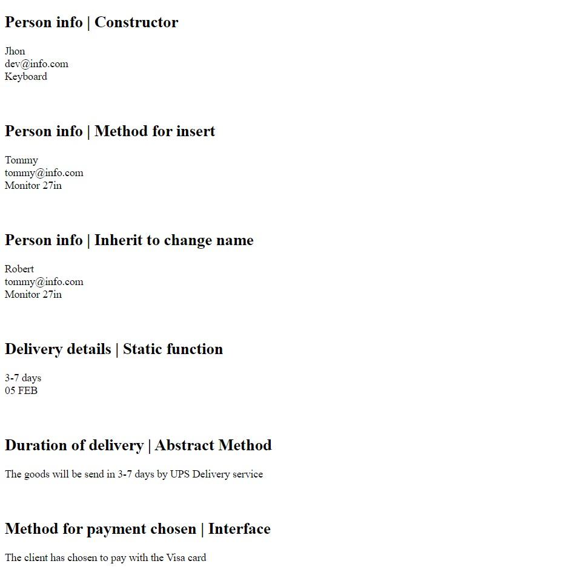

`#php` `#oop` `#master-in-software-engineering`

# JOE ALT - ASSEMBLER SCHOOL - PHP Object Oriented Programming

In this project I learned the basics of OOP using mobile devices as a reference. In the _"Project files"_ section you will find a description of the content to be displayed in each file.

## Table of contents

- [Table of contents](#table-of-contents)
- [Introduction](#introduction)
- [Dependencies](#dependencies)
- [Tools](#tools)
- [OOP Introduction](#oop-introduction)
- [Project files](#project-files)

## Introduction

### The repo

This project is made by only using PHP together with a new techniques OOP Object Oriented Programming.

**Preview of project**




## Dependencies

Before we can get started you will need to make sure that all the necessary dependencies are installed in your system.

### PHP <!-- omit in toc -->

You can install it by following the instructions [in the official docs](https://www.php.net/downloads) (we recommend that you install the version that is named _Current_).

To verify that you have installed it correctly, you can run the following command from the terminal that should output the version installed:

```bash
$ php -version
```

## Tools

In the event that you prefer to use a tool that installs everything you need to configure and run a PHP server, we recommend using [XAMPP](https://www.apachefriends.org/es/download.html)

### XAMPP <!-- omit in toc -->

XAMPP is a completely free and easy to install Apache distribution that contains MariaDB, PHP, and Perl. The XAMPP installation package has been designed to be incredibly easy to install and use.


You have to go to the [download page](https://www.apachefriends.org/es/download.html) and it will automatically recommend installing the latest version available.


Once downloaded and installed, in the case that the Windows operating system you will see the following screen, in which you will only have to start the Apache service.


## OOP Introduction

Object-oriented programming (OOP) is a programming paradigm based on the concept of "objects", which can contain data and code: data in the form of fields (often known as attributes or properties), and code, in the form of procedures (often known as methods).

## Project files

### [01 - Index](./index.php) <!-- omit in toc -->

The OOP paradigm encapsulates concepts of the real world in what is called as Classes which create Objects. In this file you will learn how to create a class and instanciate it.

The index has all the outputs of all the functions that this project represents. 

### [02 - Classes and Abstract](baseClass.php) <!-- omit in toc -->

Class member variables are called properties. In this file, you will learn how to add properties to a class and get them when the class is instantiated.

Abstract classes and methods are when the parent class has a named method, but need its child class(es) to fill out the tasks. In this file you will learn how to create and use abstract classes.

### [03 - Inherits](inherits.php) <!-- omit in toc -->

There are several disadvantages of not applying inheritance in our code. In this file you will lean what's the problem if you don't apply any inheritance in your code.

The child class will inherit all the public and protected properties and methods from the parent class. In addition, it can have its own properties and methods. In this file you will learn how to apply the inheritance in your code.

### [04 - Interface](interface.php) <!-- omit in toc -->

Interfaces allow you to specify what methods a class should implement.
Interfaces make it easy to use a variety of different classes in the same way. When one or more classes use the same interface, it is referred to as "polymorphism". In this file you will learn how to create and extend interfaces.